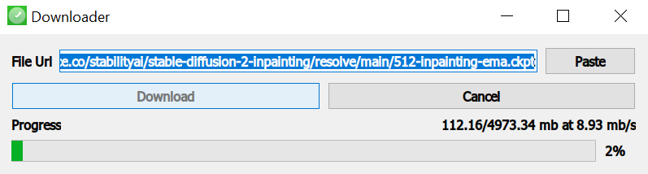

# Ai Downloader

A python file downloader with a QT GUI.

This app was almost entirely written by OpenAi Codex, but I have made some changes to improve it just a little bit.

It was intended to as a experiment to see if I could make a full functioning app in python using AI, which worked wonders as it was fully running out of the prompt result.

## Screenshot

## App icon

The app icon was also made using AI. Specifically Stable Diffusion.

